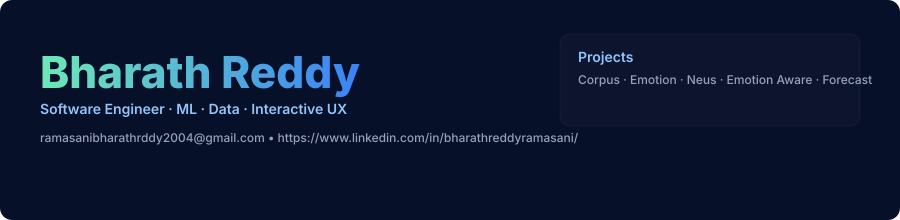
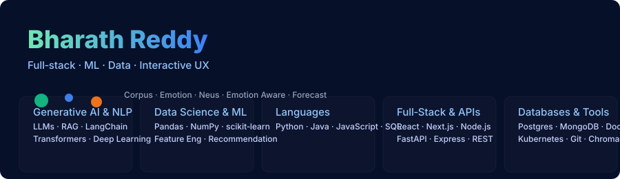

# Hi, I’m Bharath Reddy 👋

  

## About Me
I’m Bharath Reddy — a software engineer who builds production-grade systems that combine machine learning, data engineering, and polished interactive front-ends.

- 🔭 Current focus: ML pipelines, emotion-aware systems, and scalable forecasting platforms
- 🌱 Learning: advanced time-series forecasting and productionizing LLM workflows
- 💬 Ask me about: model deployment, full‑stack engineering, and animation-driven UX
- 📫 Contact: ramasanibharathrddy2004@gmail.com
- 🔗 LinkedIn: https://www.linkedin.com/in/bharathreddyramasani/

## Visual Tech Stack

This repo includes a compact, visual tech-stack layout. Use the image below as the single visual summary of my core skills and tooling.

  

## Roles
- Software Engineer (Full‑stack & MLOps)
- Machine Learning Engineer
- Data Engineer
- Front‑end Engineer (interactive & animated UX)

## Aim
To build robust, production-quality systems that deliver meaningful insights and delightful user experiences by combining ML, scalable engineering, and thoughtful design.

## Projects
- **Corpus** — data ingestion & indexing platform for multi-source corpora; optimized for semantic retrieval.
- **Emotion** — research + production pipeline for multimodal emotion recognition with explainability.
- **Neus** — neural utilities: model-serving patterns, inference optimization, and monitoring.
- **Emotion Aware** — real-time UI adaptation and recommendations driven by emotion inference.
- **Forecast (Celebal Project)** — enterprise-grade time-series forecasting with ensembles and backtesting.

---

If you want a different tone (concise, research-focused, or product-focused), a GIF instead of the SVG hero, or added links to live project demos, say the word and I’ll update it.
